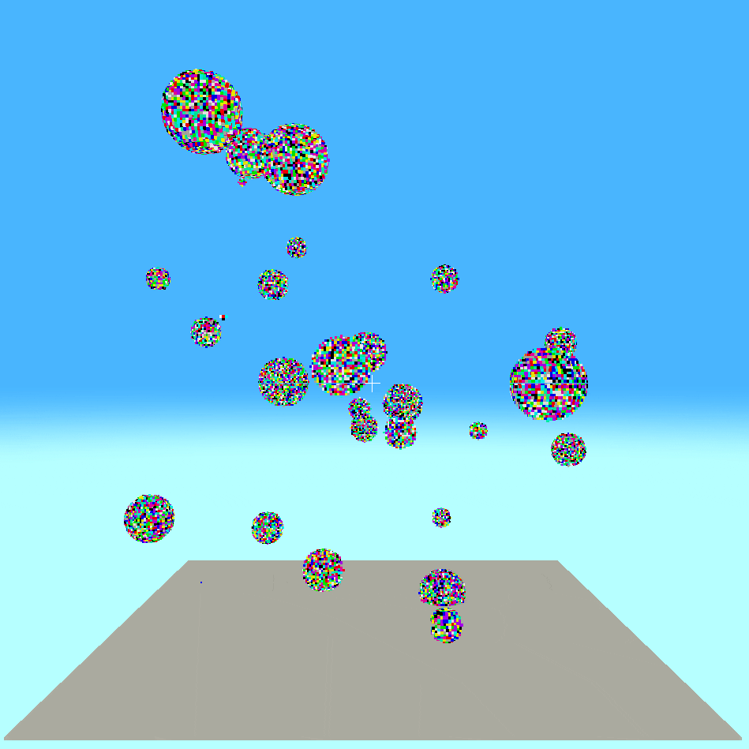

# Fast GPU Generation of Distance Fields from a Voxel Grid

<p align="center">
  
  
</p>


## 🚀 Overview
Fast GPU Generation of Distance Fields from a Voxel Grid is a real-time voxel painting application built in Rust, designed to explore and optimize techniques for generating distance fields directly on the GPU.
The project compares several existing algorithms and proposes a new optimized approach suitable for interactive applications.

Whether you're painting in voxels or pushing the limits of real-time computation, this project showcases how GPU acceleration can make complex field generation *blazingly fast*.

## ✨Features
- Interactive voxel painting interface
- Real-time distance field generation using GPU shaders
- A comparison of multiple distance field algorithms in the report
- Optimized distance field generation pipeline for minimal latency

## 🛠️ Running the Application
Make sure you have Rust installed. You can run the application with:

```bash
# Clone the repository
git clone https://github.com/Fedron/gpu-voxel-fields.git
cd voxels/implementation

# Build and run the app
cargo run --release
```

## 📈 Results Summary
Through a comparison of existing distance field generation techniques, this project develops an optimized GPU-based method that achieves real-time performance, significantly outperforming naive approaches especially on larger voxel grids.

**Key improvements:**
- Reduction in computation time by 99% compared to a brute force approach
- Improved scalability to larger voxel volumes

**Limitations:**
- Large memory usage as memory representation and compression was not a focus of the paper
- Ray marcher computation time bottleneck at large voxel volumes

## 📂 Repository Structure

```
/implementation - Rust sourcec ode for the voxel painting application and distance field generation compute shader
/report         - LaTeX source files for the full dissertation report, and a complete PDF
```

## 📜 License
This project is licensed under the [MIT License](LICENSE).
